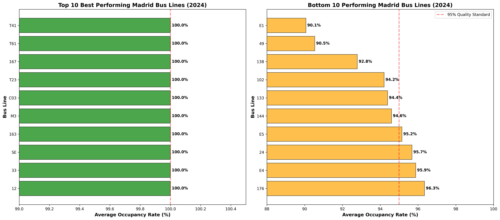
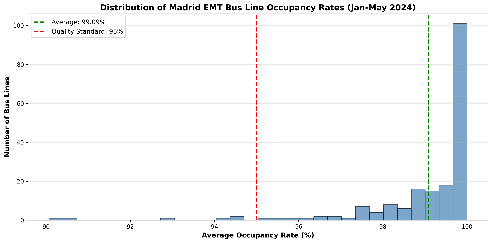
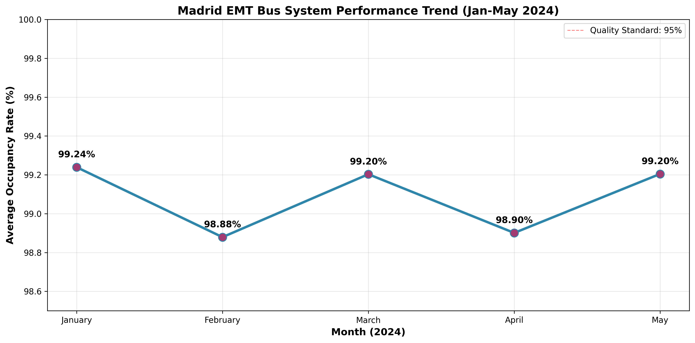

# Madrid EMT Bus System Performance Analysis

## Project Overview
Analysis of 190 Madrid EMT bus lines to identify operational efficiency, capacity issues, and optimization opportunities using official city data from January-May 2024.

## Key Findings

### Overall Performance
- **System-wide average:** 99.09% occupancy compliance
- **Lines meeting quality standards (≥95%):** 184 out of 190 (96.8%)
- **Lines requiring attention:** 6 (3.2%)
- **Performance trend:** Stable (-0.03% change over 5 months)

### Top Performers (100% Compliance)
- Line 12: Plaza de Cristo Rey - Paseo Marqués de Zafra
- Line 33: Príncipe Pío - Casa de Campo
- Line 163: Estación Aravaca - El Plantío
- Line M3: Sol/Sevilla - Puerta de Toledo
- Line C03: Puerta de Toledo - Argüelles
- *Plus 60+ additional lines at 100%*

### Lines Requiring Intervention
1. **Line E1** (Atocha - Plaza Elíptica): 90.07% - HIGH PRIORITY
2. **Line 49** (Plaza de Castilla - Pitis): 90.54% - Improving (+2.41%)
3. **Line 138** (Plaza de Cristo Rey - Aluche): 92.79% - Improving (+3.88%)
4. **Line 102** (Atocha Renfe - Estación El Pozo): 94.21%
5. **Line 133** (Plaza del Callao - Mirasierra): 94.39%
6. **Line 144** (Pavones - Entrevías): 94.60%

## Business Recommendations

### Immediate Actions (Lines E1, 102, 144)
- Increase bus frequency during peak hours
- Deploy larger capacity buses
- Analyze ridership patterns for specific problem time slots
- Consider express/limited-stop variants

### Monitor Closely (Lines 49, 138, 133)
- Continue current improvement trajectory
- Lines show positive trends and may naturally reach 95% threshold
- Replicate successful interventions already in place

### Maintain Excellence (184 compliant lines)
- Continue current operational standards
- Use high-performing lines as benchmarks
- Share best practices across the network

### Strategic Initiatives
- Implement real-time occupancy monitoring
- Use predictive analytics for dynamic fleet allocation
- Prioritize infrastructure improvements (bus lanes, priority signals)
- Evaluate route redesign for chronically overcrowded lines

## Technologies Used
- **Python** - Core analysis
- **Pandas** - Data manipulation and cleaning
- **Matplotlib** - Data visualization
- **NumPy** - Statistical calculations
- **Google Colab** - Development environment

## Methodology
1. Data acquisition from Madrid Open Data Portal (datos.madrid.es)
2. Data cleaning (removed 5 incomplete/special service lines)
3. Monthly occupancy analysis (January-May 2024)
4. Performance benchmarking against 95% quality standard
5. Trend analysis and pattern identification
6. Prioritization of interventions based on severity and trend

## Visualizations

*Comparison of best and worst performing bus lines*

*Distribution showing most lines cluster around 99-100% compliance*

*Stable performance trend from January to May 2024*

## Data Source
Madrid Open Data Portal (datos.madrid.es)
- Dataset: "EMT. Grado de ocupación de líneas de autobús 2024"
- Period: January - May 2024
- Coverage: 190 daytime bus lines

## Context
This analysis uses official occupancy compliance data, which measures the percentage of trips that meet quality standards. Quality standards define maximum occupancy as the number of seats plus the result of multiplying free space by 3.75 passengers/m².

## Limitations
- Data only available through May 2024 (incomplete year)
- Does not include nighttime bus lines
- Occupancy compliance % does not directly show absolute ridership numbers
- External factors (weather, events, construction) not captured in dataset

## Skills Demonstrated
- Public sector data analysis
- Transportation/logistics optimization
- Operational efficiency analysis
- Data cleaning and preprocessing
- Statistical trend analysis
- Business recommendations from data
- Working with Spanish-language datasets
- Local market knowledge (Madrid)

## Author
Diogo Justiniano Pinto  
[LinkedIn](https://www.linkedin.com/in/diogojustiniano/)

## Language Note
Analysis conducted in English with Spanish dataset. Column translations:
- Código = Code
- Etiqueta = Label
- Ruta = Route
- Grado de ocupación = Occupancy level